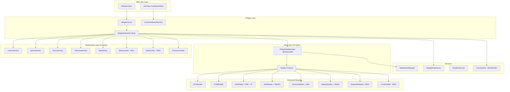

# Stats Master Menu Bar Parity (Extended PRD Scope)

## Overview

Replace Tonic's current menu bar widget system with Stats Master's implementation to achieve full feature parity. This epic has been extended to include all requirements from the comprehensive PRD at `~/.claude/plans/golden-juggling-nebula.md`.

**Original Scope (Tasks 1-14)**: 8 widget types, 10 visualizations, core Stats Master features
**Extended Scope (Tasks 15-20)**: Full PRD parity with Bluetooth, Clock, enhanced colors, standardized popovers

**Current Implementation State**:
- 8 widget types: CPU, GPU, Memory, Disk, Network, Weather, Battery, Sensors
- 12 visualization types: mini, lineChart, barChart, pieChart, tachometer, stack, speed, networkChart, batteryDetails, label, state, text
- Reader protocol established with CPUReader, MemoryReader, DiskReader, NetworkReader, GPUReader, BatteryReader, SensorsReader
- OneView mode infrastructure in place
- Notification system foundation complete

**Target State (Full PRD)**:
- 10 widget types: + Bluetooth, Clock (Tasks 15-16)
- 14 visualization types: + memory, battery (Task 17)
- 30+ color options with utilization-based coloring (Task 19)
- Standardized popover layouts per PRD specs (Task 18)
- Comprehensive per-widget settings UI (Task 20)

## Scope

### Original Scope (Completed/In Progress)
1. Enhanced Data Readers - CPU, RAM, Disk, Network, GPU, Battery, Sensors ✅
2. Process Monitoring UI ✅
3. Notification System - Foundation complete, UI pending (Task 10)
4. OneView Mode - Infrastructure ready (Task 11)
5. Widget Visualization Enhancements (Task 12)
6. User Preferences Migration ✅
7. Code Cleanup (Task 14)

### Extended Scope (New Tasks 15-20)
1. **Bluetooth Module** (Task 15) - Device batteries, connection status via IOBluetooth
2. **Clock Module** (Task 16) - Multiple timezone display
3. **Memory/Battery Visualizations** (Task 17) - Two-row memory, battery icon with fill
4. **Popover Standardization** (Task 18) - 280px width, consistent sections
5. **Enhanced Color System** (Task 19) - 30+ colors, utilization-based coloring
6. **Per-Widget Settings UI** (Task 20) - Granular widget customization

## Architecture Diagram



## Implementation Phases

### Phase 1: Foundation (Tasks 1-3) ✅ COMPLETE
- Reader Architecture Foundation
- Enhanced Data Models
- Notification System Foundation

### Phase 2: Data Readers (Tasks 4-8) - PARTIAL
- CPU Enhanced Reader ✅
- RAM Enhanced Reader (Task 5 - pending)
- Network Enhanced Reader ✅
- Disk Enhanced Reader (Task 7 - pending)
- Sensors & Battery Enhanced Readers (Task 8 - pending)

### Phase 3: Core UI (Tasks 9-12) - PARTIAL
- Process Monitoring UI ✅
- Notification System Implementation (Task 10 - pending)
- OneView Mode (Task 11 - pending)
- Widget Visualization Enhancements (Task 12 - pending)

### Phase 4: PRD Expansion (Tasks 15-20) - NEW
- Bluetooth Module (Task 15)
- Clock Module (Task 16)
- Memory/Battery Visualizations (Task 17)
- Popover Layout Standardization (Task 18)
- Enhanced Color System (Task 19)
- Per-Widget Settings UI (Task 20)

### Phase 5: Cleanup (Tasks 13-14)
- User Preferences Migration ✅
- Code Cleanup and Documentation (Task 14 - pending)

## Non-Functional Targets

| Metric | Target | Measurement |
|--------|--------|-------------|
| CPU Impact | <1% per widget | Activity Monitor |
| Memory Impact | <50MB baseline | Memory graph |
| Update Latency | <500ms refresh | Timestamp delta |
| Widget Startup | <2s all enabled | Time to visible |
| Preference Migration | <100ms | Migration timing |

## Acceptance Criteria

### Core Functionality
- [ ] All 10 widget types work (8 original + Bluetooth + Clock)
- [ ] All 14 visualization types render correctly
- [ ] Process monitoring displays top apps for CPU, RAM, Disk, Network
- [ ] Notification system sends configurable threshold alerts
- [ ] OneView mode combines all widgets into single menu bar item
- [ ] Weather widget continues to work

### Extended PRD Requirements
- [ ] Bluetooth module shows device batteries and connection status
- [ ] Clock module displays multiple timezone clocks
- [ ] `memory` visualization shows two-row used/total format
- [ ] `battery` visualization shows battery icon with fill level
- [ ] 30+ color options available with utilization-based auto-coloring
- [ ] All popovers use standardized 280px layout with consistent sections
- [ ] Per-widget settings accessible from popover and main settings

### Performance
- [ ] CPU impact <1% per widget during normal operation
- [ ] Memory usage <50MB baseline
- [ ] Menu bar click response <100ms

## Quick Commands

```bash
# Build Tonic
xcodebuild -scheme Tonic -configuration Debug build

# Run unit tests
xcodebuild test -scheme Tonic -destination 'platform=macOS'

# Verify widget configs
defaults read com.tonic.Tonic tonic.widget.configs

# Profile CPU usage
sample Tonic 10 -file profile.txt
```

## References

### PRD Document
- Location: `~/.claude/plans/golden-juggling-nebula.md`
- Sections: Modules (2.1-2.9), Visualizations (3), Colors (4), Settings (5), Popovers (7)

### Tonic Source
- Widget configuration: `Tonic/Tonic/Models/WidgetConfiguration.swift`
- Visualization types: `Tonic/Tonic/Models/VisualizationType.swift`
- Widget factory: `Tonic/Tonic/MenuBarWidgets/WidgetFactory.swift`
- Reader protocol: `Tonic/Tonic/Services/WidgetReader/WidgetReader.swift`
- Design tokens: `Tonic/Tonic/Design/DesignTokens.swift`

### Stats Master Reference
- Directory: `/Users/saransh1337/Developer/Projects/TONIC/stats-master/`
- Bluetooth module: `stats-master/Modules/Bluetooth/`
- Color handling: `stats-master/Kit/helpers/colors.swift`


---
# Task Specifications


## Task fn-6-i4g.15

# fn-6-i4g.15 Bluetooth Module Implementation

## Description
Implement the Bluetooth module to display connected device information and battery levels in the menu bar widget system. This adds Tonic's 9th data source (matching Stats Master's module count).

**Size:** M
**Files:**
- `Tonic/Tonic/Services/WidgetReader/BluetoothReader.swift` (new)
- `Tonic/Tonic/Models/WidgetConfiguration.swift` (add `.bluetooth` case)
- `Tonic/Tonic/MenuBarWidgets/BluetoothWidgetView.swift` (new)
- `Tonic/Tonic/Services/WidgetDataManager.swift` (add bluetooth data)

## Approach

- Create `BluetoothReader` conforming to existing `WidgetReader` protocol at `Services/WidgetReader/WidgetReader.swift:4-14`
- Use `IOBluetooth` framework (not CoreBluetooth) to access paired device info without user prompts
- Follow pattern from `BatteryReader.swift` for IOKit-style device enumeration
- Add `.bluetooth` case to `WidgetType` enum following pattern at `Models/WidgetConfiguration.swift:14-63`
- Compatible visualizations: `stack` (device battery levels), `mini` (single device), `state` (connected indicator)

## Key Context

**IOBluetooth vs CoreBluetooth**: Use IOBluetooth for reading device properties without triggering Bluetooth permission dialogs. CoreBluetooth requires entitlements and user prompts.

**Data structure from PRD**:
```swift
struct BluetoothDevice {
    id: UUID
    name: String
    address: String
    deviceType: BluetoothDeviceType  // .mouse, .keyboard, .headphones, .other
    isConnected: Bool
    isPaired: Bool
    batteryLevel: Int?             // 0-100%
    rssi: Int?                     // Signal strength dBm
}
```
## Acceptance
- [ ] `BluetoothReader` reads all paired Bluetooth devices
- [ ] Device battery levels display for HID devices (keyboard, mouse, trackpad)
- [ ] Connection status (connected/paired/disconnected) for each device
- [ ] Device type icons (SF Symbols: keyboard, mouse, headphones, speaker)
- [ ] `stack` visualization shows multiple device batteries
- [ ] `mini` visualization shows single device (user-selectable)
- [ ] `state` visualization shows connected/disconnected dot
- [ ] Widget appears in widget configuration UI
- [ ] No Bluetooth permission dialog triggered on read
- [ ] Graceful handling when Bluetooth disabled
## Done summary
TBD

## Evidence
- Commits:
- Tests:
- PRs:

## Task fn-6-i4g.16

# fn-6-i4g.16 Clock Module Implementation

## Description
Implement the Clock module to display multiple timezone clocks in the menu bar. This is a simple module that doesn't require system APIs - just TimeZone and Date formatting.

**Size:** S
**Files:**
- `Tonic/Tonic/Services/WidgetReader/ClockReader.swift` (new)
- `Tonic/Tonic/Models/WidgetConfiguration.swift` (add `.clock` case)
- `Tonic/Tonic/MenuBarWidgets/ClockWidgetView.swift` (new)
- `Tonic/Tonic/Models/ClockConfiguration.swift` (new - timezone list)

## Approach

- Create `ClockReader` conforming to `WidgetReader` protocol - simply returns formatted time strings
- Add `.clock` case to `WidgetType` enum at `Models/WidgetConfiguration.swift:14-63`
- Store user's timezone preferences in new `ClockConfiguration` struct
- Compatible visualizations: `stack` (multiple timezones), `text` (single timezone)
- Update interval: 1 second for clock display

## Key Context

**Data structure from PRD**:
```swift
struct ClockEntry {
    id: UUID
    name: String                   // Display name (e.g., "Tokyo", "London")
    timezone: TimeZone
    format: String                 // Time format string (e.g., "HH:mm", "h:mm a")
    isEnabled: Bool
}
```

**Popover content**: List of configured timezones with current time, date, UTC offset, DST indicator.
## Acceptance
- [ ] `ClockReader` returns formatted time for configured timezones
- [ ] User can add/remove/reorder timezone entries in settings
- [ ] `stack` visualization shows multiple timezone clocks (2-row layout)
- [ ] `text` visualization shows single timezone with custom format
- [ ] Time format customizable (12/24 hour, with/without seconds)
- [ ] Popover shows full timezone list with date, UTC offset, DST status
- [ ] Widget updates every second when visible
- [ ] Default timezone list includes local time + 2-3 common zones
## Done summary
TBD

## Evidence
- Commits:
- Tests:
- PRs:

## Task fn-6-i4g.17

# fn-6-i4g.17 Memory and Battery Visualization Types

## Description
Add two new visualization types to achieve full PRD parity: `memory` (two-row used/total display) and `battery` (battery icon with fill level). These are specialized visualizations distinct from existing types.

**Size:** S
**Files:**
- `Tonic/Tonic/Models/VisualizationType.swift` (add cases)
- `Tonic/Tonic/MenuBarWidgets/Views/MemoryWidgetView.swift` (new)
- `Tonic/Tonic/MenuBarWidgets/ChartStatusItems/MemoryStatusItem.swift` (new)
- `Tonic/Tonic/MenuBarWidgets/Views/BatteryWidgetView.swift` (enhance existing)
- `Tonic/Tonic/MenuBarWidgets/WidgetFactory.swift` (add cases)
- `Tonic/Tonic/Models/WidgetConfiguration.swift` (add to compatibleVisualizations)

## Approach

- Follow existing visualization pattern at `VisualizationType.swift:15-118`
- `memory` visualization: Two stacked rows showing "8.2 GB" over "16 GB" with order toggle option
- `battery` visualization: Battery icon with fill level (distinct from `batteryDetails` text display)
- Add to `WidgetFactory.createWidget()` switch at `WidgetFactory.swift:38-68`
- Update `compatibleVisualizations` for Memory and Battery widget types

## Key Context

**`memory` visualization** (from PRD):
- Width: ~50pt variable
- Shows used memory on top row, total on bottom
- Order toggle: user can swap which value is on top
- Supports symbols option (show memory icon)

**`battery` visualization** (from PRD):
- Width: ~40pt variable  
- Battery icon with fill level based on percentage
- Additional info options: none, percentage inside, percentage beside, time remaining
- Charger icon when charging
## Acceptance
- [ ] `memory` case added to `VisualizationType` enum
- [ ] `battery` case added to `VisualizationType` enum  
- [ ] `MemoryWidgetView` displays two-row used/total format
- [ ] Memory widget order toggle works (swap top/bottom values)
- [ ] Battery icon fills proportionally to battery percentage
- [ ] Battery icon shows charging indicator when plugged in
- [ ] Battery additional info options work (none/inside/%/time)
- [ ] Both visualizations integrate with `WidgetFactory`
- [ ] Memory visualization compatible with `.memory` widget type
- [ ] Battery visualization compatible with `.battery` widget type
## Done summary
TBD

## Evidence
- Commits:
- Tests:
- PRs:

## Task fn-6-i4g.18

# fn-6-i4g.18 Popover Layout Standardization

## Description
Standardize all widget popover layouts to match PRD specifications. Currently popovers have inconsistent layouts - this task creates a unified template with consistent dimensions, sections, and styling.

**Size:** M
**Files:**
- `Tonic/Tonic/MenuBarWidgets/Popovers/PopoverConstants.swift` (new)
- `Tonic/Tonic/MenuBarWidgets/Popovers/PopoverTemplate.swift` (new)
- `Tonic/Tonic/MenuBarWidgets/CPUWidgetView.swift` (refactor popover)
- `Tonic/Tonic/MenuBarWidgets/MemoryWidgetView.swift` (refactor popover)
- `Tonic/Tonic/MenuBarWidgets/DiskWidgetView.swift` (refactor popover)
- `Tonic/Tonic/MenuBarWidgets/NetworkWidgetView.swift` (refactor popover)
- `Tonic/Tonic/MenuBarWidgets/GPUWidgetView.swift` (refactor popover)
- `Tonic/Tonic/MenuBarWidgets/BatteryWidgetView.swift` (refactor popover)
- `Tonic/Tonic/MenuBarWidgets/SensorsWidgetView.swift` (if exists, refactor)

## Approach

- Create `PopoverConstants` struct with PRD layout values at `Popovers/PopoverConstants.swift`
- Create reusable `PopoverTemplate` view that provides standard header, sections, and styling
- Refactor each widget's popover to use template pattern
- Follow existing design patterns from `Design/DesignComponents.swift`

## Key Context

**PRD Layout Constants**:
```swift
struct PopoverConstants {
    static let width: CGFloat = 280
    static let maxHeight: CGFloat = 500
    static let headerHeight: CGFloat = 44
    static let sectionSpacing: CGFloat = 12
    static let itemSpacing: CGFloat = 8
    static let horizontalPadding: CGFloat = 16
    static let cornerRadius: CGFloat = 12
}
```

**Standard sections**:
1. Header (44pt): Module icon + title + settings gear
2. Dashboard (variable): Large primary metric + main visualization
3. Details Grid (variable): Two-column key-value pairs
4. Chart Section (optional, ~120pt): Full-width chart
5. Process List (optional, variable): Top processes by usage
## Acceptance
- [ ] `PopoverConstants` struct created with PRD-specified values
- [ ] `PopoverTemplate` provides reusable header with icon, title, settings button
- [ ] All 8 widget popovers use consistent 280pt width
- [ ] All popovers have consistent section spacing (12pt)
- [ ] Details grids use two-column layout with 8pt item spacing
- [ ] Process list section configurable (0, 3, 5, 8, 10, 15 rows)
- [ ] Chart section appears where applicable (CPU, Memory, Network, GPU)
- [ ] Settings gear button opens widget-specific settings
- [ ] Dark/light mode styling consistent across all popovers
- [ ] Header icons use correct SF Symbols per widget type
## Done summary
TBD

## Evidence
- Commits:
- Tests:
- PRs:

## Task fn-6-i4g.19

# fn-6-i4g.19 Enhanced Color System with Utilization-Based Coloring

## Description
Enhance the color system to match PRD specifications: 30+ fixed color options, automatic utilization-based coloring (green→yellow→orange→red), color zones, and monochrome mode support.

**Size:** S
**Files:**
- `Tonic/Tonic/Models/WidgetConfiguration.swift` (expand `WidgetAccentColor`)
- `Tonic/Tonic/Design/WidgetColors.swift` (new - color palette)
- `Tonic/Tonic/Design/ColorZones.swift` (new - threshold-based coloring)

## Approach

- Expand `WidgetAccentColor` enum at `WidgetConfiguration.swift:126-175` with full PRD palette
- Create `ColorZone` struct for threshold-based automatic coloring
- Add utilization color calculation: green (0-50%), yellow (50-75%), orange (75-90%), red (90-100%)
- Add cluster colors for CPU E/P cores: teal (E-cores), indigo (P-cores)
- Add monochrome mode that adapts to light/dark appearance

## Key Context

**PRD Fixed Colors (30 options)**:
```
Primary: red, green, blue, yellow, orange, purple, brown, cyan, magenta, pink, teal, indigo
Secondary: secondRed, secondGreen, secondBlue, secondYellow, secondOrange, secondPurple, secondBrown
Grays: gray, secondGray, darkGray, lightGray
Other: white, black, clear
```

**Utilization-based coloring**:
- Use `.utilizationBased` as color option that auto-calculates from value
- Configurable thresholds via `ColorZone` struct

**Monochrome mode**:
- Single color that adapts to appearance (white in dark mode, black in light mode)
- Used when user wants minimal visual distraction
## Acceptance
- [ ] `WidgetAccentColor` expanded to 30+ color options
- [ ] `.utilizationBased` color option auto-calculates from widget value
- [ ] Utilization colors: green (0-50%), yellow (50-75%), orange (75-90%), red (90-100%)
- [ ] `ColorZone` struct enables custom threshold definitions
- [ ] CPU cluster colors available: teal for E-cores, indigo for P-cores
- [ ] Monochrome mode adapts to system appearance
- [ ] All existing widgets support new color options
- [ ] Color picker in settings shows full palette
- [ ] Colors persist correctly in `WidgetConfiguration`
## Done summary
TBD

## Evidence
- Commits:
- Tests:
- PRs:

## Task fn-6-i4g.20

# fn-6-i4g.20 Per-Widget Settings UI Enhancement

## Description
Enhance the widget settings UI to support per-widget customization for all PRD-specified options. Currently settings are limited - this task adds granular control for each widget.

**Size:** M
**Files:**
- `Tonic/Tonic/Views/WidgetCustomizationView.swift` (major enhancement)
- `Tonic/Tonic/Views/WidgetSettingsSheet.swift` (new - per-widget settings)
- `Tonic/Tonic/Models/WidgetConfiguration.swift` (ensure all options stored)

## Approach

- Create `WidgetSettingsSheet` for detailed per-widget configuration
- Follow existing view patterns at `Views/WidgetCustomizationView.swift`
- Use `DesignComponents` for consistent styling
- Per-widget settings include: visualization type, color, display mode, update interval, label, chart config

## Key Context

**Per-Widget Settings (from PRD Section 5.3)**:
- Label on/off
- Color selection (30+ options)
- Box/Frame toggle (for charts)
- History length (30-120 points)
- Scale type (linear/square/cube/log)
- Alignment options
- Monochrome toggle
- Icon options (for speed/battery widgets)

**Settings accessed via**: Gear button in popover header (from Task 18) or widget row in main settings.
## Acceptance
- [ ] `WidgetSettingsSheet` created for per-widget configuration
- [ ] Settings sheet accessible from popover header gear button
- [ ] Settings sheet accessible from widget row in main settings
- [ ] Visualization type picker shows compatible options per widget
- [ ] Color picker shows full 30+ color palette
- [ ] Update interval picker (1, 2, 3, 5, 10, 15, 30, 60 seconds)
- [ ] Label toggle works per-widget
- [ ] Chart config: history length slider (30-120 points)
- [ ] Chart config: scale type picker (linear/square/cube/log)
- [ ] Chart config: box/frame toggle
- [ ] Changes persist immediately to `WidgetPreferences`
- [ ] Reset to defaults button per widget
## Done summary
TBD

## Evidence
- Commits:
- Tests:
- PRs:
