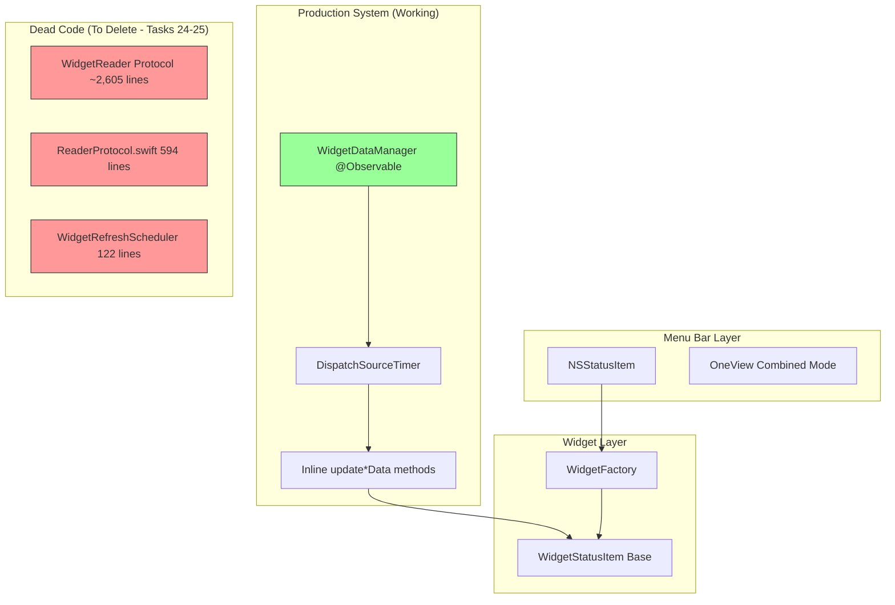

# Stats Master Menu Bar Parity (Extended PRD + Cleanup)

## Overview

Replace Tonic's current menu bar widget system with Stats Master's implementation to achieve full feature parity. This epic includes critical cleanup tasks to address ~3,300 lines of dead code from an aborted architecture migration.

**Critical Finding**: The codebase contains THREE separate reader architectures:
1. **Production Architecture** (WidgetDataManager with inline methods) - ✅ WORKING
2. **WidgetReader Protocol** (9 reader implementations) - ❌ DEAD (~2,605 lines)
3. **Reader Protocol** (BaseReader + Repeater) - ❌ UNUSED (594 lines)

**Only #1 is used in production.** Tasks 21-26 address the critical cleanup and completion issues.

**Original Scope (Tasks 1-14)**: 8 widget types, 14 visualizations, core Stats Master features
**Extended Scope (Tasks 15-20)**: Full PRD parity with Bluetooth, Clock, enhanced colors
**Cleanup Scope (Tasks 21-26)**: Fix build errors, add missing integrations, delete dead code

**Current Implementation State**:
- 8 widget types: CPU, GPU, Memory, Disk, Network, Weather, Battery, Sensors
- 14 visualization types: mini, lineChart, barChart, pieChart, tachometer, stack, speed, networkChart, batteryDetails, label, state, text, memory, battery
- OneView mode ✅ working
- Notification system foundation ✅ complete
- Color system ✅ 32 colors (exceeds 30+ requirement)

## Scope

### Original Scope (Tasks 1-14) - Mostly Complete
1. Enhanced Data Readers - CPU, RAM, Disk, Network, GPU, Battery, Sensors ✅
2. Process Monitoring UI ✅
3. Notification System - Foundation complete (Task 10) - 75% done (missing Net/BT)
4. OneView Mode ✅ (Task 11)
5. Widget Visualization Enhancements ✅ (Task 12) - 92% done
6. User Preferences Migration ✅ (Task 13)
7. Code Cleanup (Task 14) - todo

### Extended Scope (Tasks 15-20) - Mostly Complete
1. **Bluetooth Module** ✅ (Task 15)
2. **Clock Module** (Task 16) - todo
3. **Memory/Battery Visualizations** ✅ (Task 17)
4. **Popover Standardization** (Task 18) - todo
5. **Enhanced Color System** ✅ (Task 19) - 32 colors
6. **Per-Widget Settings UI** (Task 20) - todo

### Cleanup Scope (Tasks 21-26) - NEW
1. **Fix Critical Build Errors** (Task 21)
   - PlaceholderDetailView missing (3 StatusItem files)
   - SensorsReader syntax error
2. **Add Missing Notification Integrations** (Task 22)
   - Network: checkThreshold() not called
   - Bluetooth: checkThreshold() not called
3. **Add Missing History Tracking** (Task 23)
   - GPU, Battery, Sensors, Disk - no history arrays populated
4. **Delete Dead WidgetReader Directory** (Task 24)
   - ~2,605 lines of never-used code
5. **Delete Dead Scheduler/Reader Protocol** (Task 25)
   - WidgetRefreshScheduler.swift (122 lines)
   - ReaderProtocol.swift (594 lines)
6. **Complete Data Population** (Task 26)
   - 11 optional fields never populated (CPU, Network, Battery)

## Critical Issues Summary

| Issue | Severity | Lines | Status |
|-------|----------|-------|--------|
| PlaceholderDetailView missing | HIGH | Build error | Task 21 |
| Network notification missing | MEDIUM | Integration gap | Task 22 |
| Bluetooth notification missing | MEDIUM | Integration gap | Task 22 |
| GPU history missing | LOW | Feature gap | Task 23 |
| Battery history missing | LOW | Feature gap | Task 23 |
| Sensors history missing | LOW | Feature gap | Task 23 |
| Disk history missing | LOW | Feature gap | Task 23 |
| Dead WidgetReader code | TECHNICAL DEBT | ~2,605 | Task 24 |
| Dead Scheduler/Protocol | TECHNICAL DEBT | ~716 | Task 25 |
| 11 data fields empty | FEATURE GAP | N/A | Task 26 |

## Architecture Diagram



## Implementation Phases

### Phase 1: Foundation (Tasks 1-3) ✅ COMPLETE
- Reader Architecture Foundation
- Enhanced Data Models
- Notification System Foundation

### Phase 2: Data Readers (Tasks 4-8) ✅ COMPLETE
- CPU Enhanced Reader ✅
- RAM Enhanced Reader ✅
- Network Enhanced Reader ✅
- Disk Enhanced Reader ✅
- Sensors & Battery Enhanced Readers ✅

### Phase 3: Core UI (Tasks 9-12) ✅ COMPLETE
- Process Monitoring UI ✅
- Notification System Implementation ✅ (75% - missing Net/BT integrations)
- OneView Mode ✅
- Widget Visualization Enhancements ✅ (92%)

### Phase 4: PRD Expansion (Tasks 15-20) - MOSTLY COMPLETE
- Bluetooth Module ✅ (Task 15)
- Clock Module (Task 16) - todo
- Memory/Battery Visualizations ✅ (Task 17)
- Popover Layout Standardization (Task 18) - todo
- Enhanced Color System ✅ (Task 19) - 32 colors
- Per-Widget Settings UI (Task 20) - todo

### Phase 5: Cleanup (Tasks 21-26) - NEW
- Fix Critical Build Errors (Task 21)
- Add Missing Notification Integrations (Task 22)
- Add Missing History Tracking (Task 23)
- Delete Dead WidgetReader Directory (Task 24)
- Delete Dead Scheduler/Reader Protocol (Task 25)
- Complete Data Population (Task 26)

## Non-Functional Targets

| Metric | Target | Measurement |
|--------|--------|-------------|
| CPU Impact | <1% per widget | Activity Monitor |
| Memory Impact | <50MB baseline | Memory graph |
| Update Latency | <500ms refresh | Timestamp delta |
| Widget Startup | <2s all enabled | Time to visible |
| Dead Code Removed | ~3,300 lines | Lines deleted |

## Acceptance Criteria

### Critical Fixes (Tasks 21-23)
- [ ] PlaceholderDetailView references resolved (Task 21)
- [ ] Network notification integrated (Task 22)
- [ ] Bluetooth notification integrated (Task 22)
- [ ] GPU/Battery/Sensors/Disk history tracking added (Task 23)

### Dead Code Removal (Tasks 24-25)
- [ ] WidgetReader directory deleted (~2,605 lines)
- [ ] WidgetRefreshScheduler.swift deleted (122 lines)
- [ ] ReaderProtocol.swift deleted (594 lines)
- [ ] Project builds without errors
- [ ] All widgets still functional

### Data Population (Task 26)
- [ ] Battery: optimizedCharging, chargerWattage populated
- [ ] CPU: thermalLimit, averageLoad, frequency populated
- [ ] Network: wifiDetails, publicIP populated
- [ ] CPU: temperature, eCore/pCoreUsage populated (if feasible)
- [ ] Network: connectivity populated (if feasible)

### Core Functionality
- [ ] All 8 widget types work (CPU, GPU, Memory, Disk, Network, Weather, Battery, Sensors)
- [ ] All 14 visualization types render correctly
- [ ] Notification system sends alerts for all 8 widget types (100% coverage)
- [ ] OneView mode combines all widgets into single menu bar item
- [ ] Line charts show historical data for all applicable widgets

## Quick Commands

```bash
# Build Tonic
xcodebuild -scheme Tonic -configuration Debug build

# Verify no WidgetReader references remain
grep -r "WidgetReader" Tonic/Tonic/ --exclude-dir=WidgetReader

# Verify no ReaderProtocol references remain
grep -r ": Reader<" Tonic/Tonic/

# Count lines removed (for verification)
wc -l Tonic/Tonic/Services/WidgetReader/*  # before deletion
wc -l Tonic/Tonic/Services/WidgetRefreshScheduler.swift  # before deletion
wc -l Tonic/Tonic/Services/ReaderProtocol.swift  # before deletion
```

## References

### Production System
- WidgetDataManager: `Tonic/Tonic/Services/WidgetDataManager.swift`
  - updateCPUData(): line 796
  - updateMemoryData(): line 1168
  - updateDiskData(): line 1553
  - updateNetworkData(): line 1960
  - updateGPUData(): line 2474
  - updateBatteryData(): line 2626
  - updateSensorsData(): line 2807
  - updateBluetoothData(): line 3214

### Dead Code (To Delete)
- WidgetReader/: `Tonic/Tonic/Services/WidgetReader/`
- WidgetRefreshScheduler: `Tonic/Tonic/Services/WidgetRefreshScheduler.swift`
- ReaderProtocol: `Tonic/Tonic/Services/ReaderProtocol.swift`

### Build Error Files
- SpeedStatusItem: `Tonic/Tonic/MenuBarWidgets/ChartStatusItems/SpeedStatusItem.swift`
- TachometerStatusItem: `Tonic/Tonic/MenuBarWidgets/ChartStatusItems/TachometerStatusItem.swift`
- PieChartStatusItem: `Tonic/Tonic/MenuBarWidgets/ChartStatusItems/PieChartStatusItem.swift`
