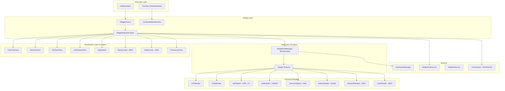

# Stats Master Menu Bar Parity (Extended PRD Scope)

## Overview

Replace Tonic's current menu bar widget system with Stats Master's implementation to achieve full feature parity. This epic has been extended to include all requirements from the comprehensive PRD at `~/.claude/plans/golden-juggling-nebula.md`.

**Original Scope (Tasks 1-14)**: 8 widget types, 10 visualizations, core Stats Master features
**Extended Scope (Tasks 15-20)**: Full PRD parity with Bluetooth, Clock, enhanced colors, standardized popovers

**Current Implementation State**:
- 8 widget types: CPU, GPU, Memory, Disk, Network, Weather, Battery, Sensors
- 12 visualization types: mini, lineChart, barChart, pieChart, tachometer, stack, speed, networkChart, batteryDetails, label, state, text
- Reader protocol established with CPUReader, MemoryReader, DiskReader, NetworkReader, GPUReader, BatteryReader, SensorsReader
- OneView mode infrastructure in place
- Notification system foundation complete

**Target State (Full PRD)**:
- 10 widget types: + Bluetooth, Clock (Tasks 15-16)
- 14 visualization types: + memory, battery (Task 17)
- 30+ color options with utilization-based coloring (Task 19)
- Standardized popover layouts per PRD specs (Task 18)
- Comprehensive per-widget settings UI (Task 20)

## Scope

### Original Scope (Completed/In Progress)
1. Enhanced Data Readers - CPU, RAM, Disk, Network, GPU, Battery, Sensors ✅
2. Process Monitoring UI ✅
3. Notification System - Foundation complete, UI pending (Task 10)
4. OneView Mode - Infrastructure ready (Task 11)
5. Widget Visualization Enhancements (Task 12)
6. User Preferences Migration ✅
7. Code Cleanup (Task 14)

### Extended Scope (New Tasks 15-20)
1. **Bluetooth Module** (Task 15) - Device batteries, connection status via IOBluetooth
2. **Clock Module** (Task 16) - Multiple timezone display
3. **Memory/Battery Visualizations** (Task 17) - Two-row memory, battery icon with fill
4. **Popover Standardization** (Task 18) - 280px width, consistent sections
5. **Enhanced Color System** (Task 19) - 30+ colors, utilization-based coloring
6. **Per-Widget Settings UI** (Task 20) - Granular widget customization

## Architecture Diagram



## Implementation Phases

### Phase 1: Foundation (Tasks 1-3) ✅ COMPLETE
- Reader Architecture Foundation
- Enhanced Data Models
- Notification System Foundation

### Phase 2: Data Readers (Tasks 4-8) - PARTIAL
- CPU Enhanced Reader ✅
- RAM Enhanced Reader (Task 5 - pending)
- Network Enhanced Reader ✅
- Disk Enhanced Reader (Task 7 - pending)
- Sensors & Battery Enhanced Readers (Task 8 - pending)

### Phase 3: Core UI (Tasks 9-12) - PARTIAL
- Process Monitoring UI ✅
- Notification System Implementation (Task 10 - pending)
- OneView Mode (Task 11 - pending)
- Widget Visualization Enhancements (Task 12 - pending)

### Phase 4: PRD Expansion (Tasks 15-20) - NEW
- Bluetooth Module (Task 15)
- Clock Module (Task 16)
- Memory/Battery Visualizations (Task 17)
- Popover Layout Standardization (Task 18)
- Enhanced Color System (Task 19)
- Per-Widget Settings UI (Task 20)

### Phase 5: Cleanup (Tasks 13-14)
- User Preferences Migration ✅
- Code Cleanup and Documentation (Task 14 - pending)

## Non-Functional Targets

| Metric | Target | Measurement |
|--------|--------|-------------|
| CPU Impact | <1% per widget | Activity Monitor |
| Memory Impact | <50MB baseline | Memory graph |
| Update Latency | <500ms refresh | Timestamp delta |
| Widget Startup | <2s all enabled | Time to visible |
| Preference Migration | <100ms | Migration timing |

## Acceptance Criteria

### Core Functionality
- [ ] All 10 widget types work (8 original + Bluetooth + Clock)
- [ ] All 14 visualization types render correctly
- [ ] Process monitoring displays top apps for CPU, RAM, Disk, Network
- [ ] Notification system sends configurable threshold alerts
- [ ] OneView mode combines all widgets into single menu bar item
- [ ] Weather widget continues to work

### Extended PRD Requirements
- [ ] Bluetooth module shows device batteries and connection status
- [ ] Clock module displays multiple timezone clocks
- [ ] `memory` visualization shows two-row used/total format
- [ ] `battery` visualization shows battery icon with fill level
- [ ] 30+ color options available with utilization-based auto-coloring
- [ ] All popovers use standardized 280px layout with consistent sections
- [ ] Per-widget settings accessible from popover and main settings

### Performance
- [ ] CPU impact <1% per widget during normal operation
- [ ] Memory usage <50MB baseline
- [ ] Menu bar click response <100ms

## Quick Commands

```bash
# Build Tonic
xcodebuild -scheme Tonic -configuration Debug build

# Run unit tests
xcodebuild test -scheme Tonic -destination 'platform=macOS'

# Verify widget configs
defaults read com.tonic.Tonic tonic.widget.configs

# Profile CPU usage
sample Tonic 10 -file profile.txt
```

## References

### PRD Document
- Location: `~/.claude/plans/golden-juggling-nebula.md`
- Sections: Modules (2.1-2.9), Visualizations (3), Colors (4), Settings (5), Popovers (7)

### Tonic Source
- Widget configuration: `Tonic/Tonic/Models/WidgetConfiguration.swift`
- Visualization types: `Tonic/Tonic/Models/VisualizationType.swift`
- Widget factory: `Tonic/Tonic/MenuBarWidgets/WidgetFactory.swift`
- Reader protocol: `Tonic/Tonic/Services/WidgetReader/WidgetReader.swift`
- Design tokens: `Tonic/Tonic/Design/DesignTokens.swift`

### Stats Master Reference
- Directory: `/Users/saransh1337/Developer/Projects/TONIC/stats-master/`
- Bluetooth module: `stats-master/Modules/Bluetooth/`
- Color handling: `stats-master/Kit/helpers/colors.swift`
