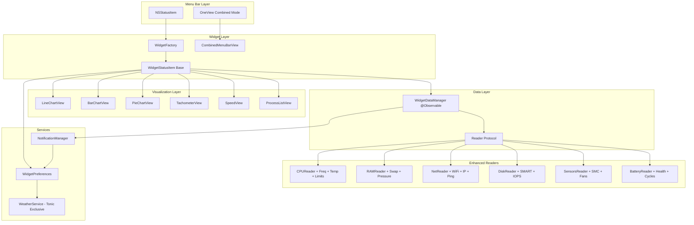

# Stats Master Menu Bar Parity

## Overview

Replace Tonic's current menu bar widget system with Stats Master's implementation to achieve full feature and design parity. Stats Master is a mature menu bar monitoring app with superior system monitoring capabilities, more widget types, and advanced features like process monitoring, notifications, and oneView combined mode.

**Current State (Tonic)**:
- 8 widget types: CPU, GPU, Memory, Disk, Network, Weather, Battery, Sensors
- 10 visualization types: mini, lineChart, barChart, pieChart, tachometer, stack, speed, batteryDetails, label, text
- SwiftUI + AppKit hybrid architecture
- Unified timer system (efficient)
- Centralized `WidgetDataManager`
- In-memory historical data only

**Target State (from Stats Master)**:
- 14 widget types with 9 modules: CPU, RAM, Disk, Net, GPU, Battery, Sensors, Bluetooth, Clock
- Advanced readers: SMC sensors, NVMe SMART, WiFi details, network connectivity (ICMP ping)
- Process monitoring UI (top apps by resource usage)
- Notification system with configurable thresholds
- OneView combined mode (all widgets in single menu bar item)
- Public IP tracking with change notifications
- Historical data persistence (DB)
- Pure AppKit implementation

**Key Decision**: Keep Tonic's SwiftUI + AppKit hybrid architecture (more maintainable) while adopting Stats Master's features and readers. Migrate to `@Observable` pattern already in use.

## Scope

### In Scope (Must-Have)
1. **Enhanced Data Readers** - Migrate Stats Master's reader implementations:
   - CPU: Per-core with E/P cluster colors, frequency, thermal limits
   - RAM: Pressure levels, swap usage, process list
   - Disk: NVMe SMART data, IOPS, activity per volume
   - Network: WiFi details (SSID, RSSI, channel, security), public IP tracking
   - GPU: Temperature, frequency, fan speed (Apple Silicon)
   - Battery: Health, cycles, optimized charging detection
   - Sensors: Full SMC integration (temperature, voltage, power, fans)

2. **Process Monitoring UI** - Display top apps by CPU, RAM, Disk, Network usage in widget popovers

3. **Notification System** - Threshold-based alerts for all module types

4. **OneView Mode** - Combine all widgets into single menu bar item (configurable)

5. **Widget Configuration Migration** - Preserve user preferences during migration

6. **Tonic-Exclusive Features to Keep**:
   - Weather widget (Open-Meteo API - differentiator)
   - SwiftUI-based visualization views
   - Unified timer architecture (more efficient)

### Out of Scope (Explicitly Excluded)
1. Bluetooth module (requires additional entitlements, limited use case)
2. Clock module (macOS already has clock in menu bar)
3. Remote data sharing (Stats Master feature not needed for Tonic)
4. Database persistence for historical data (keep in-memory for simplicity)
5. Pure AppKit migration (keep SwiftUI + AppKit hybrid)

### Migration Strategy
- Delete current Tonic menu bar widget implementations
- Copy/adapt Stats Master implementations to Tonic's architecture
- Create migration layer for existing user preferences
- Maintain backward compatibility for Weather widget

## Approach

### Phase 1: Foundation (Tasks 1-3)
Establish the core infrastructure to support Stats Master features.

**Phase 1.1: Reader Architecture**
- Create `Reader<T>` protocol inspired by Stats Master but adapted for `@Observable`
- Implement `Repeater` class for per-reader timing (optional, can use unified timer)
- Define reader lifecycle: `start()`, `stop()`, `pause()`, `interval` property
- Follow Tonic's existing pattern at `WidgetDataManager.swift:289-350` for Observable data

**Phase 1.2: Enhanced Data Models**
- Extend existing data models in `SystemEnums.swift` and `VisualizationType.swift`
- Add: `ProcessUsage`, `WiFiDetails`, `PublicIPInfo`, `SensorsFullData`, `NVMeSMARTData`
- Maintain `Sendable` conformance for thread safety

**Phase 1.3: Notification System Foundation**
- Create `NotificationManager` singleton following `WidgetPreferences` pattern
- Define `NotificationThreshold` struct (value, condition, enabled)
- Create `NotificationPermission` type wrapper around macOS notifications

### Phase 2: Data Readers (Tasks 4-8)
Implement Stats Master's reader functionality using Tonic's architecture.

**Phase 2.1: CPU Enhanced Reader**
- Migrate from `stats-master/Modules/CPU/readers.swift:42-151`
- Add: FrequencyReader, TemperatureReader, LimitReader, AverageLoadReader
- Use existing `host_processor_info()` pattern from `WidgetDataManager.swift:468-525`
- Add E/P core cluster coloring

**Phase 2.2: RAM Enhanced Reader**
- Migrate from `stats-master/Modules/RAM/readers.swift`
- Add swap tracking and pressure level detailed states
- Process reader for top RAM consumers

**Phase 2.3: Network Enhanced Reader**
- Migrate from `stats-master/Modules/Net/readers.swift`
- Add WiFi details via `CWWiFiClient`
- Add public IP via API call
- Add connectivity test via ICMP ping
- Process reader for top network consumers

**Phase 2.4: Disk Enhanced Reader**
- Migrate from `stats-master/Modules/Disk/readers.swift`
- Add NVMe SMART data reading via IOKit
- Add IOPS tracking
- Process reader for top disk I/O consumers

**Phase 2.5: Sensors & Battery Enhanced Readers**
- Migrate SMC reader from `stats-master/Modules/Sensors/readers.swift`
- Add fan speed with min/max
- Add voltage and power sensors
- Battery: Add health, cycles, optimized charging detection

### Phase 3: Process Monitoring UI (Task 9)
Create UI to display process resource usage.

**Process List View**:
- Create `ProcessListView` SwiftUI component
- Display: PID, app name, usage %, icon
- Sortable by usage column
- Filterable by module (CPU/RAM/Disk/Net)
- Follow `DesignComponents.Card` pattern

**Integration**:
- Add to widget popover views
- Reuse existing `topCPUApps` and `topMemoryApps` from `WidgetDataManager.swift:1189-1219`

### Phase 4: Notification System Implementation (Task 10)
Complete notification system with UI.

**Notification Manager**:
- Implement threshold checking per reader update
- Queue notifications to prevent spam
- Respect "Do Not Disturb" system state

**Notification Settings UI**:
- Add to `WidgetCustomizationView.swift`
- Per-module threshold sliders
- Enable/disable per notification type

### Phase 5: OneView Mode (Task 11)
Implement combined menu bar item mode.

**OneView Widget**:
- Create `CombinedMenuBarView` with all enabled widgets
- Grid layout for compact display
- Scrollable if overflow
- Click opens unified popup

**Configuration**:
- Add toggle to `WidgetPreferences`: `unifiedMenuBarMode`
- Migrate individual widgets when mode toggles

### Phase 6: Widget Visualization Enhancements (Task 12)
Enhance existing visualizations with Stats Master features.

**Chart Enhancements**:
- Add value overlay to line charts
- Add per-core E/P cluster coloring
- Add logarithmic scaling option (already exists in `ScalingMode`)

**New Visualization: networkChart**
- Dual-line chart for upload/download
- Separate colors per direction
- Independent scaling options

### Phase 7: Migration & Cleanup (Tasks 13-14)
Complete migration and remove old code.

**User Preferences Migration**:
- Create migration layer in `WidgetPreferences`
- Map old configs to new structure
- One-time migration on app launch
- Fallback to defaults if migration fails

**Code Cleanup**:
- Delete old widget implementations in `MenuBarWidgets/`
- Remove duplicate `WidgetsPanelView` (per git status)
- Update `CLAUDE.md` with new architecture

## Alternatives Considered

| Option | Pros | Cons | Decision |
|--------|------|------|----------|
| **A: Pure AppKit Migration** | 1:1 code port from Stats Master, proven | Loses SwiftUI benefits, harder to maintain, regresses codebase | ❌ Rejected |
| **B: SwiftUI + AppKit Hybrid** | Modern, maintainable, keeps Tonic architecture | Requires adapting AppKit code, more upfront effort | ✅ **Selected** |
| **C: Feature-by-Feature Add** | Incremental, lower risk per release | Longer timeline, inconsistent UX during transition | ❌ Rejected for full parity requirement |
| **D: Separate Menu Bar App** | Clean separation, could open-source | User confusion, two apps to manage | ❌ Rejected |

## Non-Functional Targets

| Metric | Target | Measurement |
|--------|--------|-------------|
| CPU Impact | <1% per widget | Activity Monitor during monitoring |
| Memory Impact | <50MB baseline | Memory graph for widget process |
| Update Latency | <500ms for data refresh | Timestamp delta in `WidgetDataManager` |
| Menu Bar Responsiveness | No lag on click | Subjective + event timing |
| Widget Startup | <2s to display all enabled | Time from `start()` to visible |
| Preference Migration | <100ms for typical user | Migration function timing |
| Crash Rate | 0 crashes per 1000 widget-hours | Crashlytics |

## Architecture Diagram



## Rollout Plan

### Release Strategy: Single Major Release
This is a breaking change (menu bar widgets replaced), so ship as major version update.

### Pre-Release
1. Beta testing with team members
2. Migration testing on various macOS versions (14.0, 14.6, 15.0)
3. Performance benchmarking
4. Accessibility testing

### Release
1. Update `CFBundleShortVersionString` to major version (e.g., 2.0.0)
2. Release notes highlighting new features
3. Migration occurs automatically on first launch
4. Old preferences backed up before migration

### Rollback Plan
If critical issues discovered:
1. Revert to previous version
2. Users who migrated will get defaults on revert (acceptable)
3. Backup preferences can be restored manually if needed

## Documentation Updates

**Files to Update**:
1. `CLAUDE.md` - Add new reader architecture, notification system
2. `Tonic/Tonic/Views/WidgetOnboardingView.swift` - Update to reflect new features
3. `README.md` (if exists) - Update feature list

**New Documentation Needed**:
1. Notification system guide (how to configure thresholds)
2. OneView mode explanation
3. Process monitoring interpretation guide

## Metrics to Track

| Metric | Why | How |
|--------|-----|-----|
| Widget enablement rate | Are users adopting new features? | Aggregate anonymous config stats |
| Notification opt-in rate | Is notification system useful? | Count enabled notifications |
| OneView mode usage | Is combined mode popular? | Track unifiedMenuBarMode setting |
| Migration success rate | Did users' configs migrate cleanly? | Error logging in migration code |
| Widget crash rate | Stability of new code | Crashlytics with widget tags |

## Risks & Mitigations

| Risk | Impact | Likelihood | Mitigation |
|------|--------|------------|------------|
| SMC helper tool fails to install | High temp/fan sensors unavailable | Medium | Fallback to IOKit thermal info, graceful degradation |
| Migration corrupts user preferences | Users lose widget configurations | Low | Backup before migration, validate after, rollback on error |
| Performance regression with all readers | System slowdown | Medium | Keep unified timer, lazy reader initialization |
| macOS API incompatibility | Crashes on newer macOS | Low | Version checking, beta testing on macOS 15 |
| Open-Meteo API deprecation | Weather widget breaks | Low | Monitor API status, consider alternative |
| Notification spam | Users disable all notifications | Medium | Rate limiting, smart deduplication |
| OneView mode overflow | Menu bar can't show all widgets | Low | Scrollable container, max widget limit |

## Acceptance Criteria

### Core Functionality
- [ ] All 8 Tonic widget types work with Stats Master-enhanced data
- [ ] Process monitoring UI displays top 5 apps for CPU, RAM, Disk, Network
- [ ] Notification system sends alerts for configured thresholds
- [ ] OneView mode combines all widgets into single menu bar item
- [ ] Weather widget continues to work (Tonic exclusive feature)

### Data Readers
- [ ] CPU reader shows per-core usage with E/P cluster colors
- [ ] CPU reader shows frequency, thermal limits
- [ ] RAM reader shows pressure levels, swap usage
- [ ] Network reader shows WiFi details (SSID, RSSI, channel)
- [ ] Network reader shows public IP with change detection
- [ ] Network reader performs connectivity test (ICMP ping)
- [ ] Disk reader shows NVMe SMART data (temp, life, cycles)
- [ ] Disk reader shows IOPS
- [ ] Sensors reader shows temperature, voltage, power, fans via SMC
- [ ] Battery reader shows health, cycles, optimized charging status

### UI/UX
- [ ] All visualization types render correctly (10 types)
- [ ] Widget popovers include process monitoring section
- [ ] Notification settings accessible from widget customization
- [ ] OneView toggle in widget settings
- [ ] Dark/light mode adaptation works
- [ ] VoiceOver announces widget values correctly

### Migration
- [ ] Existing user preferences migrate without data loss
- [ ] Backup created before migration
- [ ] Migration fails gracefully to defaults
- [ ] Migration completes in <100ms for typical user

### Performance
- [ ] CPU impact <1% per widget during normal operation
- [ ] Memory usage <50MB baseline for widget system
- [ ] Menu bar click response <100ms
- [ ] All widgets load within 2s of app launch

### Code Quality
- [ ] All old widget code removed from `MenuBarWidgets/`
- [ ] No duplicate `WidgetsPanelView` (per git status)
- [ ] `CLAUDE.md` updated with new architecture
- [ ] All new code follows `@Observable`, `@MainActor`, `Sendable` patterns
- [ ] No compiler warnings

## Quick Commands

```bash
# Build Tonic with new menu bar system
xcodebuild -scheme Tonic -configuration Debug build

# Run unit tests (when available)
xcodebuild test -scheme Tonic -destination 'platform=macOS'

# Check for Swift compilation errors
swift build 2>&1 | grep -i error

# Measure memory impact
instruments -t "Allocations" -D trace.trace \
  /Users/saransh1337/Developer/Projects/TONIC/build/Release/Tonic.app

# Profile CPU usage
sample Tonic 10 -file profile.txt

# Verify menu bar widgets appear
defaults read com.tonic.Tonic tonic.widget.configs

# Test migration manually
defaults delete com.tonic.Tonic tonic.widget.configs
# Then launch app and check default widgets appear
```

## References

### Stats Master Source
- Directory: `/Users/saransh1337/Developer/Projects/TONIC/stats-master/`
- CPU readers: `stats-master/Modules/CPU/readers.swift:42-151`
- RAM readers: `stats-master/Modules/RAM/readers.swift`
- Network readers: `stats-master/Modules/Net/readers.swift`
- Disk readers: `stats-master/Modules/Disk/readers.swift`
- Sensors readers: `stats-master/Modules/Sensors/readers.swift`
- Battery readers: `stats-master/Modules/Battery/readers.swift`
- Widget base: `stats-master/Kit/module/widget.swift:31-127`
- Reader protocol: `stats-master/Kit/module/reader.swift:123-149`

### Tonic Source
- Widget data manager: `Tonic/Tonic/Services/WidgetDataManager.swift:289-1219`
- Widget configuration: `Tonic/Tonic/Models/WidgetConfiguration.swift:14-559`
- Visualization types: `Tonic/Tonic/Models/VisualizationType.swift:15-179`
- Widget status item: `Tonic/Tonic/MenuBarWidgets/WidgetStatusItem.swift:18-639`
- Widget factory: `Tonic/Tonic/MenuBarWidgets/WidgetFactory.swift:14-110`
- Widget customization: `Tonic/Tonic/Views/WidgetCustomizationView.swift:14-898`

### Key Patterns to Follow
- `@Observable` pattern: `WidgetConfiguration.swift:291-294`
- `@MainActor` isolation: `WidgetStatusItem.swift:17`
- `Sendable` conformance: All data models
- Design tokens: `Tonic/Tonic/Design/DesignTokens.swift`
- Timer management: `WidgetStatusItem.swift:546-563`

### External APIs
- Open-Meteo (Weather): `https://open-meteo.com/` - keep for Weather widget
- Public IP detection: Stats Master uses external API (verify and adapt)
- macOS IOKit: For SMC, GPU, NVMe access
- CoreWLAN: For WiFi details
