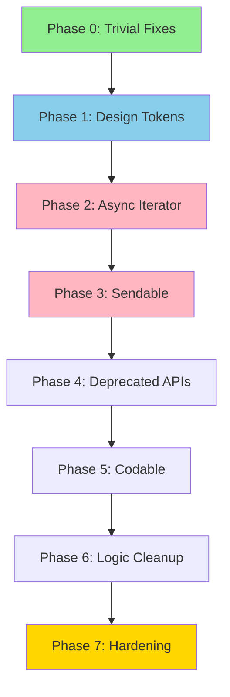

# Tonic Xcode Warnings: Fix All 395 Compiler Warnings

## Overview

Fix all ~395 Xcode compiler warnings in the Tonic macOS application. The warnings fall into 7 categories:

| Category | Count | Severity |
|----------|-------|----------|
| Deprecated Design Tokens (Typography) | ~180 | Low |
| Deprecated Design Tokens (Colors) | ~70 | Low |
| Swift 6 Async Iterator | 15 | High |
| Swift 6 Sendable/Concurrency | ~20 | High |
| Deprecated macOS APIs | ~13 | Medium |
| Codable/Init Issues | 9 | Medium |
| Logic/Cleanup | ~50 | Low |
| Protocol/Storyboard | 2 | Low |

## Goals

- **Zero compiler warnings** - `xcodebuild clean build` reports 0 warnings
  - All deprecated API warnings MUST be eliminated (no deferrals)
- **Preserve existing behavior** - No functional regressions
- **Fix at source** - No warning suppressions

## Architecture



## Phases

### Phase 0 — Trivial Structural Fixes (2 warnings)
- Fix redundant `Identifiable` protocol in `ActionTable.swift:30`
- **Storyboard removal:** App uses SwiftUI lifecycle, so remove `NSMainStoryboardFile` from Info.plist, remove Main.storyboard from project.pbxproj (including Resources build phase), then delete file

### Phase 1 — Design Token Migration (~250 warnings)
Replace deprecated typography and color tokens throughout 115+ files.

**Typography Mapping** (small size changes normalize to 8-point grid):
```
.displayLarge → .h1        .displayMedium (28pt) → .h2 (24pt)   .displaySmall → .h2
.headlineLarge → .h3      .headlineMedium (18pt) → .h3 (20pt)  .headlineSmall → .bodyEmphasized
.bodyLarge → .body        .bodyMedium → .subhead                .bodySmall → .caption
.captionLarge → .captionEmphasized  .captionMedium/Sml → .caption
.monoLarge → .monoBody    .monoMedium → .monoSubhead            .monoSmall → .monoCaption
```

**Color Mapping:**
```
.text → .textPrimary              .border → .separator
.surface → .backgroundSecondary   .surfaceElevated → .backgroundTertiary
.progressLow → .success           .progressMedium → .warning      .progressHigh → .error
```

**Special:** Replace `.surfaceHovered` with existing `.unemphasizedSelectedContentBackground`

### Phase 2 — Swift 6 Async Iterator (15 warnings)
Fix `makeIterator` warnings using `while let enumerator.nextObject()` pattern (no optional chaining)

Files: `BackgroundActivityManager.swift`, `CollectorBin.swift`, `DeepCleanEngine.swift`, `FileOperations.swift`, `HiddenSpaceScanner.swift`, `PrivilegedHelperManager.swift`, `ScanCategoryScanner.swift`, `AppInventoryView.swift`

### Phase 3 — Sendable / Concurrency (~20 warnings)
- Add `Sendable` to enums (excluding `VisualizationType` which already has it)
- Fix closure capture in `SpeedTestService.swift`
- Remove `Task` capturing `self` in `WidgetDataManager.swift` deinit
- Fix `nonisolated(unsafe)` in `WidgetHistoryStore.swift`

### Phase 4 — Deprecated macOS APIs (~13 warnings) - **MUST achieve 0 warnings**
- `NSUserNotification` → Route through existing `NotificationManager.shared`
- `NSWorkspace.launchApplication` → Create helper extension
- **SMJobBless warnings MUST be eliminated:**
  - If helper is unused: Remove `PrivilegedHelperManager` entirely
  - If helper is required: Implement SMAppService migration within this phase
  - **No deferrals** - epic goal is 0 warnings

### Phase 5 — Codable / Init (9 warnings)
- Preserve existing IDs on decode using `decodeIfPresent`
- Replace `String(cString:)` with `String(decodingCString:as:)`
- Search project-wide for all occurrences

### Phase 6 — Logic & Cleanup (~50 warnings)
- Unused variables, `var` → `let`
- Unreachable catch, redundant try
- Non-optional `??`
- Duplicate switch cases
- Dangling pointer in `PerformanceValidation.swift`

### Phase 7 — Final Hardening
- Clean build verification (capture all output)
- Optionally remove deprecated aliases
- Update documentation (CLAUDE.md, Design.md, README.md)

## Dependencies

- **fn-6-i4g** (Stats Master Menu Bar Parity - Cleanup): Complete first to remove dead code
- **fn-4-as7** (UI/UX Redesign): Schedule after warning fixes to avoid design system conflicts

## Documentation Updates Required

- `CLAUDE.md` - Design token references, state management patterns
- `Tonic/docs/Design.md` - Token examples, migration guide
- `README.md` - Build instructions if Swift 6 settings change

## Quick Commands

```bash
# Clean build and count ALL warnings
xcodebuild -project Tonic/Tonic.xcodeproj -scheme Tonic clean build 2>&1 | tee /tmp/build.log
grep -i "warning" /tmp/build.log | wc -l
# Final goal: 0
```

## Acceptance

- [ ] **Phase 0:** ActionTable.swift warning gone, storyboard fully removed (project.pbxproj + file), app launches via SwiftUI
- [ ] **Phase 1:** All deprecated token warnings removed, visual spot-check passes (9 screens checked)
- [ ] **Phase 2:** No async iterator warnings, file scanning unchanged
- [ ] **Phase 3:** No Sendable warnings, no new data-race risks
- [ ] **Phase 4:** ALL deprecated API warnings = 0 (SMJobBless resolved one way or another)
- [ ] **Phase 5:** All Codable warnings removed, IDs preserved on decode
- [ ] **Phase 6:** No structural warnings remaining
- [ ] **Phase 7:** Clean build reports 0 warnings, documentation updated
- [ ] **Regression:** App runs, all features work

## Visual Spot-Check List (Phase 1)

- Preferences Window (opens, tabs work)
- Dashboard (cards display)
- Sidebar (navigation items visible)
- CPU/Memory/Disk/Network/Battery Popovers (charts readable)
- Menu Bar Widgets (fit in menu bar)

## References

**Apple:**
- [openApplication](https://developer.apple.com/documentation/appkit/nsworkspace/openapplication(at:configuration:completionHandler:))
- [UNUserNotificationCenter](https://developer.apple.com/documentation/usernotifications)
- [SMAppService](https://developer.apple.com/documentation/servicemanagement/smappservice)
- [Sendable Protocol](https://developer.apple.com/documentation/swift/sendable)

**External:**
- Swift Forums: [makeIterator in async function](https://forums.swift.org/t/xcode-16-3-cant-use-makeiterator-via-filemanagers-enumerator-at-in-async-function/78976)
- WWDC 2024: [Migrate to Swift 6](https://developer.apple.com/videos/play/wwdc2024/10169/)
